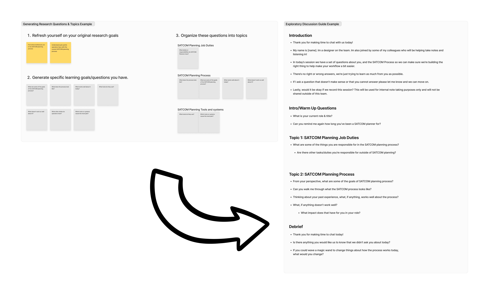

# Interview Discussion Guide

## What is it? 
A user interview discussion guide is a structured document used by researchers or interviewers to facilitate conversations with users or participants during research activities, such as user interviews. It typically outlines the topics, questions, and prompts that will guide the conversation with the user.

## Why do it? 
Helps you keep focus during the interview to uncover insights that are important for the team to learn. Having a standardized set of questions also ensures that all participants are asked the same questions, making it easier to compare responses and identify patterns.

## When to do it?
You should write a discussion guide after you’ve aligned on your research plan (add link to research plan guide). 

## Who to Involve?
Anyone on the balanced team can be involved in this process. However on a balanced team- it is typically led by product designers with input from product managers and engineers.

## Tools You Might Need
GoogleDoc, FigJam, Word. Any place to jot down ideas and work on them collaboratively with others! 

## How to do it (Steps)
1. **Generate specific research questions & topics:** Based on some of the research goals identified- generate some more specific learning goals or questions you would like answered by the end of your research.
-    Don’t worry too much about the wording just yet.

-    Once generated, group similar questions together into groups of topics. This will serve as an outline for your discussion guide.

2. **Draft the intro to your discussion guide:** Start with an introductory section and include:
-    Introduction to yourself and team-mates 
-    The purpose of the research
-    Let them know there’s no wrong answers & you’re just trying to learn as much as you can from them
-    Agenda
-    Permission to record (if applicable)

3. **Draft the body of your discussion guide:** Using the topics you generated in step one, begin to draft up the specific questions you’ll ask around each topic. 

-    It’s helpful to start with a few warm-up and higher-level questions first before diving into specifics. 

-    This is where you’ll want to think more about how the questions are phrased. (see below)

4. **Do a dry-run:** Grab someone on the team and run through your script with them to test out things like:
-    Order of questions
-    Question wording
-    Timing

> #### Interview question phrasing best practices:
 > * **Avoid Leading Questions:** Leading questions (as opposed to open-ended questions) bias participants towards thinking about the topic in the way the question was phrased (positive or negative). 

 > * **Ask about specific examples:** It’s often difficult for people to recall information in generalities. It’s usually easier to answer questions that are specific to a particular place/time.  

 > * **Ask about one thing at a time:** Asking about two things in one question (double-barreled questions) makes it difficult for participants to keep track of which part of the question they need to answer. 

 > * **Avoid questions that lead to one-word answers:** While these types of questions (close-ended questions) can be helpful at times, asking more open-ended questions often leads to more elaborate answers and allows you (the researcher) to discover more opportunities

 

## Relevant Links
[Figjam Discussion Guide Template](https://www.figma.com/file/XwZ4aZIkMDG4RDt2ZMMVPb/A-Product-Design-Process?type=whiteboard&node-id=94-887&t=dTOhh0Rvn2QxAnVH-4)
