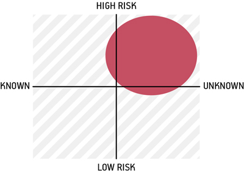
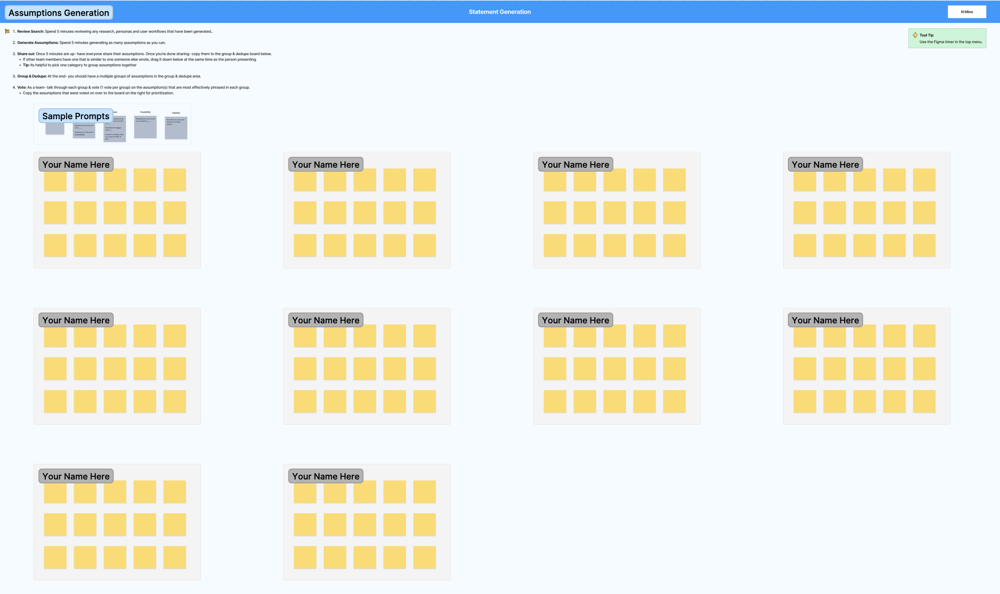
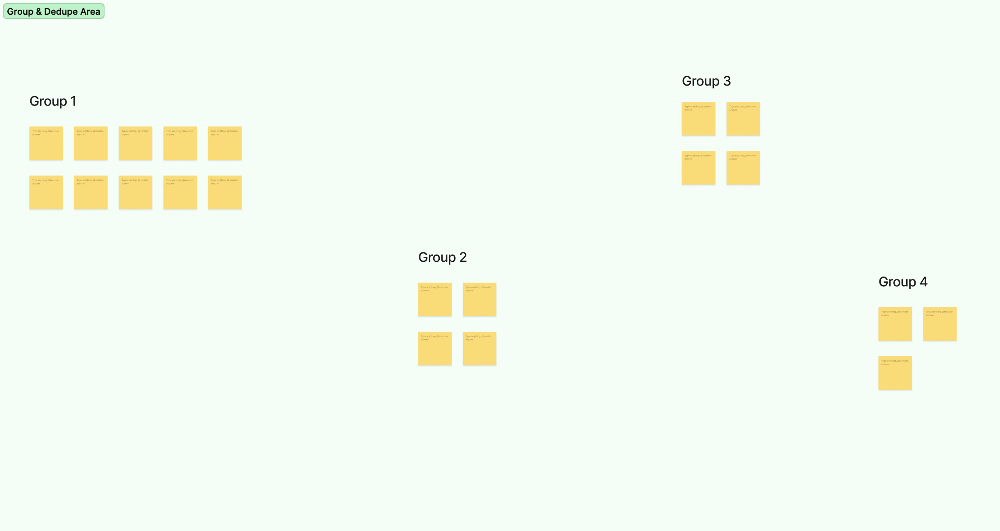

# Assumptions Workshop

## What Is It? 
An assumptions workshop helps the team gain a shared understanding of what underlying beliefs the team has about what needs to be true in order for a product to be successful. An assumption is something we believe to be true but may (or may not) have evidence for, and can range from domain context, problems solutions, usability, technical feasibility, etc. Evidence can be on a scale from “wild guess” to having validated learnings from things like market research or user engagements. 

## Why Do It? 
Assumptions are critical to agile software development! If we did research to validate every question we had, we’d be stuck in a never-ending research cycle. Assumptions help give us direction and move forward! We just have to make sure that as we make assumptions, we keep track of which ones are the riskiest.

## When To Do It?
We try to do this early in the project process in advance of any user research — often in the Kickoff itself. However, throughout a product’s lifecycle, it’s helpful for teams to articulate, prioritize and track these assumptions. 

We also recommend doing an assumptions workshop with a normal cadence on your team so that you are able to align research efforts to the riskiest assumptions at that point in time

## Who To Involve?
Balanced team, although it requires some domain context and exposure to research that’s been conducted.

## Tools You Might Need
Whiteboarding tool (Figjam, Miro, etc.) or Post-its and pens (for in-person activity)
An open mind 

## How To Do It (Steps)
1. **Review:** Spend time as a team reviewing any research, personas and user workflows that have been generated.
     
2. **Generate Assumptions:** Silently generate as many assumptions as possible.

3. **Share Assumptions:** Once everyone is done, have everyone share their assumptions. If other team members have one that is similar to one someone else wrote, start to group them together.

4. **Group & Dedupe:** At the end - you should have multiple groups of assumptions that have been grouped together

 
5. **Vote:** As a team - talk through each group & vote (1 vote per group) on the assumption(s) that are most effectively phrased in each group. Move the assumptions that were voted on over to the prioritization area.
   
6. **Prioritize:** Team will discuss and prioritize assumptions based on riskiness level and amount of evidence. You can use a simple [2X2 Matrix](https://www.productplan.com/glossary/2x2-prioritization-matrix/) to prioritize assumptions.

7. **Hypothesize & Experiment:** If time allows, the team should take the prioritized assumptions and create hypotheses and experiments to validate/invalidate the hypotheses. This can also be done with a smaller team (Design/PM/Dev Anchor) if needed.  

    > ### Facilitation Tips: 
    > If you're doing this with a large team (5+ people), here are a couple modifications:
    > 
    >   * Skip the verbal sharing out of assumptions.  
    >   * Have participants self-edit to select their top 5 assumptions.  
    >   * Move those top 5 to the group and de-dupe portion.  
    >   * Give time for folks to read silently and a way to mark things for clarifying questions.  
    >   * Verbally clarify any that are confusing.  
    >   * Continue with the group & dedupe!  

## Relevant Links
[Assumptions Figjam Template](https://www.figma.com/file/IPWcL2R6mlZvxEkdnWHK6A/Assumptions-Workshop-Template?type=whiteboard&node-id=0%3A1&t=v8FzJjBMejk4fdU5-1)

[Assumptions Content](https://docs.google.com/document/d/1pkdJoERApxOY6DnR05Jg_TsGu20f9z1Ox4UfQ1AkpPs/edit#heading=h.knf45oj1zmix) 
