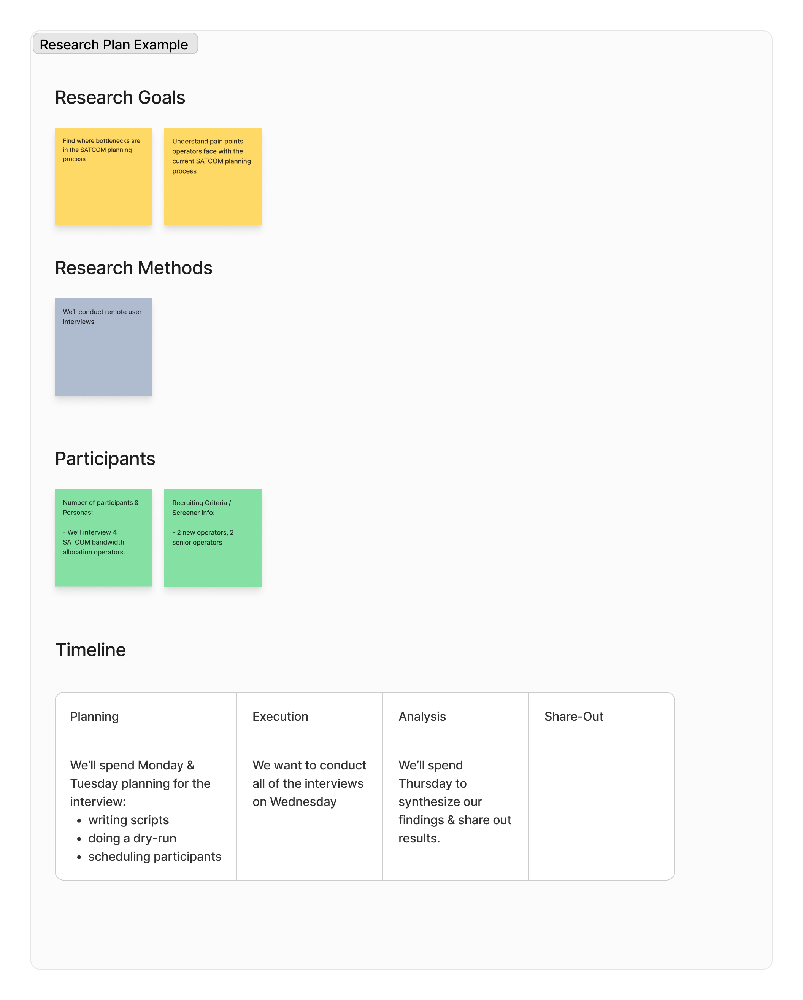

# User Research Planning 

## What is it? 
User research planning is the initial phase of a user research project where the goals, objectives, and methods are defined.

## Why do it? 
Planning your research will help you and your team align and focus your efforts. It also will help to identify the correct user research methods to use, participants to recruit, and identify the appropriate time frame the research will need to be executed in. 

## When to do it?
Anytime you or your team has identified the need to conduct more research! 

## Who to Involve?
Anyone on the balanced team can be involved in this process. However- it may be most critical to involve the designer and product managers. 

## Tools You Might Need
GoogleDoc, FigJam, Word. Any place to jot down ideas and work on them collaboratively with others! 

## How to do it (Steps)
### 1. Define research goal(s)
  * This helps keep research focused and allows you to explore various solutions when you define research methods.
  * By writing it down and agreeing on the goals, it helps keep the team aligned on what research will be performed and what is / is not a research priority.Scope goals to things you can accomplish in a research iteration
  * Make them appropriately broad / deep depending on where you are in terms of defining your product.

### 2. Determine research method(s)
  * Brainstorm which research tool(s) you can use to accomplish research goals. 
  * Add these so the same document you put your research goals in.
  * If it isn’t obvious which method(s) to use, do a collaborative session with your team / PM.
  * [UX Research Methods Cheat Sheet](https://drive.google.com/file/d/1DReMpUXp921oLGcXw-dfGWJ9mFAEKTsW/view)

### 3. Determine Participants
  * For your selected Research Method(s), determine how many participants you’ll need in order to achieve your research goals.
  * Think about what kind of users you’ll want to engage - consider the different Personas you have defined.
  * You may already have specific users in mind or may want to pull from a more generic pool of participants. Add this information to your research plan document.
  * This aligns the team around how we plan to conduct the research and what sample size is enough to gain insight.

### 4. Determine Timeline
  * Write into your plan what your timeline is for this research. 
  * If you are sending out a survey, how long will you wait for responses? If you are planning an onsite trip, how long will it take to coordinate? How long will you run an A/B test on the website for?

 

## Relevant Links
  * [Figma Research Planning Template](https://www.figma.com/file/XwZ4aZIkMDG4RDt2ZMMVPb/A-Product-Design-Process?type=whiteboard&node-id=154-1241&t=dTOhh0Rvn2QxAnVH-4)
