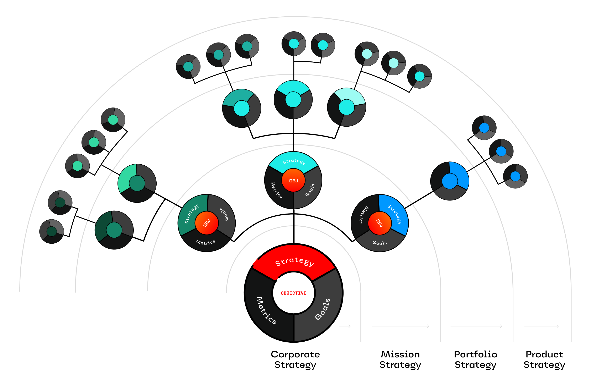

# Product Strategy 

## What Is It? 

A product strategy is a high level plan for what a team aims to accomplish with their product and how they will achieve it. This should focus on the value that the product will deliver to the target users, how that value will be delivered, and which business goals will be supported or met in the process. Product strategies may iterate over time on how they will deliver user value and support user goals, but should mostly remain focused on which user needs and business goals they support.

Product strategies usually begin their lives during the Discovery and Framing (D&F) process. At the end of D&F, product teams should have a fundamental understanding of users and their respective prioritized pain points. A deep understanding of the severity and causes of these pain points should inform which issues the product team will focus on and in which order. Teams may not always be able to directly work on the most painful problems right away but, in general, prioritizing the most painful areas will yield the most impactful results fastest. This prioritization will also form the basis for the team’s product strategy. 

## Why Do It? 
Once pain points are identified and prioritized, the product team then needs to decide how they can best solve these pains. Problems can be solved in creative or novel ways, however, teams must balance forward-leaning solutions with user adoption, technological, and process limitations (i.e users may reject a solution that eliminates all of their pain points because it doesn’t fit into their currently established process or is not compatible with their other tools). Rarely is this balance struck perfectly on the first attempt, so iterations are common and expected. 

As product teams iterate through the development process, they must always keep in mind not only the user value goals that they want to achieve but also the business goals they support (revenue, retention, adoption, etc.). Having a clear understanding of these goals and continually working towards them will ensure you create and execute an effective product strategy. 

## When To Do It?
Product strategies usually begin their lives during the Discovery and Framing (D&F) process. 

## Who To Involve?
Product Managers, Designers, Engineers, Stakeholders, Users

## Tools You Might Need
Whiteboarding tool (figjam, miro) or Post-Its and sharpies for collaboration 
Deck where product strategy lives for external stakeholders and share outs. 

## How To Do It (Steps)
Defining a product strategy involves setting a clear direction for your product's development and ensuring alignment with your overall business goals. Here are three simple steps to help you define a product strategy:

1. **Understand Your Market and Customers:**
    * Conduct market research to understand the needs and pain points of your target audience.
    * Gather feedback from existing customers through surveys, interviews, or usability tests to gain insights into their experiences and expectations.
    * Analyze competitors to identify gaps in the market and opportunities for differentiation. 

2. **Set Clear Objectives and Goals:**
    * Define specific, measurable, achievable, relevant, and time-bound (SMART) objectives for your product. These objectives should align with your organizational  goals and address the needs of your target market.
    * Prioritize your objectives based on their importance to your organization and their potential impact on your target audience.
    * Establish key metrics to track the progress and success of your product strategy. These metrics could include user engagement and customer growth. 

### Example
Although product strategy isn’t usually a single artifact or resource, it can be represented by a few key data points. Below is an example product strategy for a fictional video conferencing app. 

**Vision Statement:** To bring the world closer together 

**Business Objective(s):**  Make it easy to integrate best-in-breed technology to enable a customizable, premium experience. 

**User Outcomes(s):** User onboarding and configuring is faster than the leading competitor

**Key Metrics:** Time from account creation to first conference access

**Tactics:** Plugins are configured in advance and are easily customizable

## Relevant Links

### Product Strategy Books 
* [The Lean Startup: How Today's Entrepreneurs Use Continuous Innovation to Create Radically Successful Businesses](https://theleanstartup.com/book) by Eric Ries:
* [Hooked: How to Build Habit-Forming Products](https://www.nirandfar.com/hooked/) by Nir Eyal
* [Inspired: How To Create Products Customers Love](https://www.amazon.com/INSPIRED-Create-Tech-Products-Customers/dp/1119387507) by Marty Cagan:

### Articles: 
* [How to build a brilliant product strategy](https://www.hotjar.com/product-strategy/)
