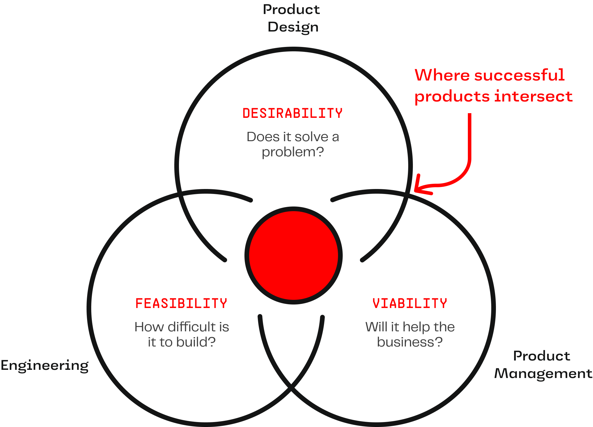

# Balanced Teams 

## What is it?
A balanced team refers to a group of individuals with diverse skills, perspectives, and roles that collaboratively work towards a common goal, typically the development and delivery of a software product. This concept emphasizes the importance of having a mix of technical, design, and business expertise within the team to ensure a comprehensive approach to product development. A balanced team often includes roles such as developers, designers, product managers, quality assurance testers, and sometimes roles focusing on user experience (UX) and user research.

## Why do it?
### Enhanced Problem Solving

The diversity of skills and perspectives allows for more creative and effective problem-solving. Different viewpoints can lead to innovative solutions that might not emerge from a more homogenous group.

### Improved Product Quality 

The combination of technical, design, and business insights contributes to the development of products that are not only functional but also user-friendly, desirable, and viable in the market.

### Faster Learning and Adaptation

A culture of collaboration and cross-functional learning enables team members to acquire new skills and adapt to changes more quickly, keeping the team and its products at the cutting edge.

## Who’s involved? 
At Rise8 we believe that the full team should be thinking about Human-Centered Design. While Product Designers are accountable for ensuring that we’re effectively uncovering user needs, pain points and validating the relative effectiveness of solutions- all team members make decisions that will directly impact the humans who use our products. Some examples of how different roles on a team may play a part in the practice of human-centered design are listed below.

### Product Manager

The Product Manager (PM) balances strategic and tactical processes with interpersonal relationship building in order to serve as a steward for their team and the product. They help lead product direction, cultivate team processes, and ensure the team is healthily functioning. 

### Product Designer

Product Designers help our clients quickly and cheaply de-risk assumptions and invest resources in building products that are more desirable and usable for our clients’ customers. This position is responsible for ensuring that user feedback drives the direction of the products we build. Designers will spend time engaging with end users to understand their needs, pain points and use their feedback to hone in on product direction. 

### Engineer

The engineer is responsible for the technical delivery of a product to the user. They focus their time on building a secure, reliable, scalable and maintainable product. They work hand-in-hand with the PM to buy down risks through backlog prioritization. 

## When to do it?
Ideally each team at Rise8 is staffed with a balanced team. 

## Relevant Links
[Balanced Teams](https://www.youtube.com/watch?v=Z_Q4Q8rCVpU) by Janice Fraser
