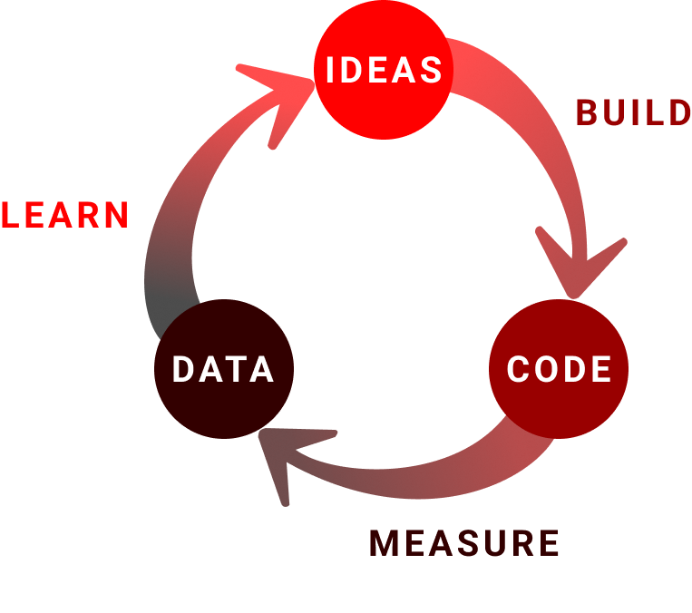

# Continuous Improvement Cycles

## What is it?

There are different frameworks and processes to help teams get into a rhythm of continuous improvement; a core principle of Agile and Lean development methodologies. These cycles can come in different flavors but all center around incremental progress, feedback loops, eliminating waste, empowering teams, and making decisions based on data.

Some popular methodologies include the "Build, Measure, Learn" loop introduced by Eric Reis in his book, *The Lean Startup*, Observe, Orient, Decide, Act (OODA) loops popular in military settings, and the Toyota Improvement Kata.

These cycles should permeate every aspect of culture and should manifest in areas such as planning, teaming, and developing.

All of these cycles take on a similar shape where you:

* **Understand the Current State:** Use quantitative and/or qualitative data to understand the current baseline.
* **Set Success Criteria:** Setting clear success criteria helps you exit the feedback loop when you have gathered just enough information to make a decision.
* **Form a Hypothesis for Improvement:** Create a hypothesis for what you will do to improve on the current state.
* **Run an experiment:** Implement an experiment to test the hypothesis.
* **Measure Results:** Determine if the hypothesis was valid/invalid based on results of the experiment.
* **Use Data to Inform Subsequent Decisions:** Based on the results, make an informed decision for what to do next. You may learn you were completely wrong with your hypothesis, so don’t be afraid to pivot to something entirely different.

*The Build Measure Lean Loop from The Lean Startup*

Teams practicing Continuous Improvement should keep intervals small to enable faster feedback and reduce risk of wasting resources. Also keep in mind that optimizing for incremental value often leads to diminishing returns. If you kept your loops small you will have learned something valuable for relatively little cost which is always a success in itself.

## Why do it?

These feedback loops help teams eliminate waste by de-risking decisions, empower them to solve problems creatively which boosts innovation, and helps teams define success objectively.

By aligning planning, teaming, development and other processes around continuous improvement cycles, it leads to rapid learning and enables to pivot when things are not working, persevere when they are. This leads to the development of better products and higher customer satisfaction.

## Relevant Links

* [Lean Startup](https://theleanstartup.com/) by Eric Reis
