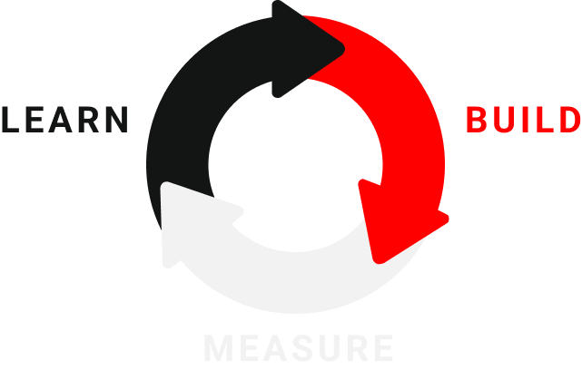

# Measure, Learn, Iterate

## What is it?
An ongoing, data-driven process following the delivery of a feature to help the team decide if it can move to the next outcome, pivot to a different approach, or stay the course and collect more data.

## Why do it?

### Validate Present State

Each release should move the team closer to its product goals, but simply having the intent to achieve outcomes for your users will not automatically do so. Oftentimes users’ responses to using features in production can differ greatly from what they may have told you during an interview or prototype test, so it is important to confirm if you have succeeded versus assuming you have.

### Inform the Future 
Measuring features in production is critical to helping the team decide what to focus on next. If you shipped a feature that is not meeting the intended outcome, the team needs to know whether to double down on that approach and ship more features to achieve the outcome, or pivot to a different strategy. 

### Build Trust
Every iteration costs time and money, so having data to justify your decisions is essential to building trust among your users and stakeholders. Users will lose interest in your product if you continually ship them features that do not solve their pains or improve their experience, and stakeholders will stop funding and/or evangelizing your product if you are spending time and money building features but cannot demonstrate why.

## Who’s involved? 
This is a full team practice but is primarily spearheaded by Product Managers and Designers.

## When to do it?
Every time a new feature is shipped to production or a new piece of data is collected. This is an ongoing process and is only considered “finished” when the feature has obtained satisfactory metrics to achieve the desired outcome

## How to do it?

1. **Have a hypothesis:** Write down your hypothesis of how you expect a feature to contribute to your desired outcome(s) before you begin an experiment so you can objectively measure against it later and avoid confirmation bias. 

2. **Pick feasible metrics with baselines:** A common pitfall of trying to measure outcomes is choosing metrics that are extremely complex to track, especially in high compliance organizations with strict security and privacy controls. Work with your team to get a sense of what you can actually measure and ensure you have the proper tooling in place before you get too far into the build process. It is also important to have a baseline to compare against, otherwise your data is subjective. 

3. **Keep intervals small:** The quicker your feedback loops are, the less risk you run of wasting resources on features that may not achieve your desired outcome.

4. **Validate in production:** Conducting interviews and prototype sessions with users is enormously valuable for informing your hypothesis, but production usage is the ultimate validator. You may find that nobody actually uses a feature in production despite telling you it would be valuable during an interview.

5. **Use data to inform decisions:** If you have established baselines and picked metrics that can be feasibly collected, it should be easy to measure how the results compare to the baselines. Look at the level of impact and determine if it is satisfactory or requires another iteration to be more meaningful.

6. **Don’t let perfection be the enemy of good:** Setting clear success criteria helps you exit the feedback loop when you have gathered just enough information to make a decision. You may learn you were completely wrong with your hypothesis, so don’t be afraid to pivot to something entirely different. Also keep in mind that optimizing for incremental value often leads to diminishing returns. If you kept your loops small you will have learned something valuable for relatively little cost which is always a success in itself. 

## Relevant Links

* [Lean Startup](https://theleanstartup.com/) by Eric Reis

