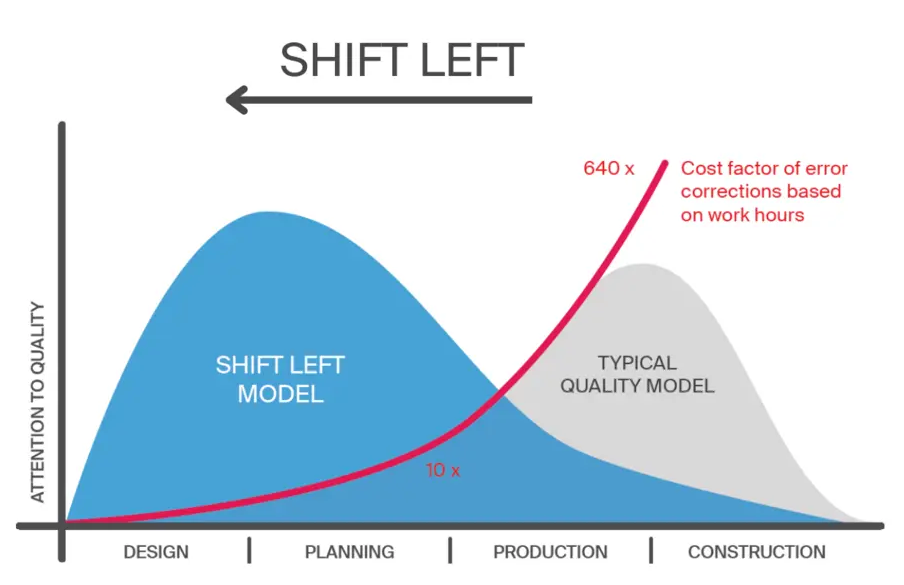

# Implementing Security Early and Throughout

## What is it?

"Shift Left" security is a practice that involves integrating security practices early and continuously throughout the software development lifecycle. This ensures vulnerabilities are addressed from the beginning rather than needing to refactor your codebase to add security later. This proactive approach minimizes risks, saves costs, and helps ensure compliance with security regulations throughout development.

### Key Concepts:

* **Company Password Policies:** Prevent easy breaches by enforcing no password re-use, easy to guess passwords (root, password, admin, 1qaz2wsx3edc keyboard walk), and require password managers.
* **Repository Security:** Implement strong authentication, encrypt secret values, and audit logging to control access and secure the codebase.
* **Service Account Security:** Apply the principle of least privilege and manage credentials securely using vaults or secret managers.
* **Service Configurations:** Configure services securely using TLS, HTTPS, and firewalls.
* **Risk Management Frameworks and Authority to Operate:** Use frameworks like NIST’s RMF to manage security risks and ensure compliance to receive an Authority to Operate (ATO). Shift from a model of doing large, full-scale RMF on every release to a continuous RMF (cRMF) approach that evaluates products based on changes since the last release and unlocks your ability to obtain a continuous ATO (cATO).
* **Secrets Vault:** Store sensitive information (e.g., passwords, API keys) securely and enforce strict access controls.
* **SSH/GPG Keys:** Secure communication and data integrity with SSH for authentication and GPG for encryption and signatures.
* **Automated Security:** Integrate security checks into CI/CD pipelines, enforce standards, and use signed images to verify code.
* **Secure Container Sources:** Pull containers only from private, signed repositories to prevent unauthorized access.
* **Continuous Integration:** Automate and enforce frequent code integration, testing, and security scans to maintain standards.
* **Controls Inheritance:** Clearly delineate which controls need to be in place at which layers and what controls an application inherits from the platform it is deployed to.

These practices form a robust security framework embedded in all development stages. Early security integration minimizes vulnerabilities, and automation ensures security checks throughout the CI/CD process. Structured risk management and secure data handling strengthen protection, while restricting code sources and minimizing permissions reduce attack vectors.

## Why Do it?

Implementing security early in the development process is cost-effective by addressing vulnerabilities at the outset, which is significantly less expensive than fixing them post-deployment. Early detection of security issues also minimizes the risk of breaches, safeguarding both the company and its users. This proactive approach helps organizations meet regulatory requirements and industry standards. Embedding security into development builds customer trust by ensuring data protection, and enhancing the company's reputation. It also enables faster time-to-market, as teams avoid delays caused by last-minute security fixes. Continuous improvement of security practices creates a culture of resilience, keeping software prepared for evolving threats.

## Relevant Links & Books

* [**Rise8 cATO Playbook**](https://playbook.rise8.us/)
* [**What is Application Security**](https://www.ibm.com/topics/application-security) **\- IBM**
* [**OWASP Secure Coding Practices**](https://owasp.org/www-project-secure-coding-practices-quick-reference-guide/)
* [**OWASP DevSecOps Guidelines**](https://owasp.org/www-project-devsecops-guideline/latest/00a-Overview)
* [**NIST Risk Management Framework**](https://csrc.nist.gov/projects/risk-management)
* [**The DevSecOps Manifesto**](http://www.devsecops.org/)
* ***Threat Modeling: Designing for Security*** by Adam Shostack
* ***The Phoenix Project: A Novel About IT, DevOps, and Helping Your Business Win*** by Gene Kim, Kevin Behr, and George Spafford
* ***Accelerate: The Science of Lean Software and DevOps*** by Nicole Forsgren, Jez Humble, and Gene Kim
