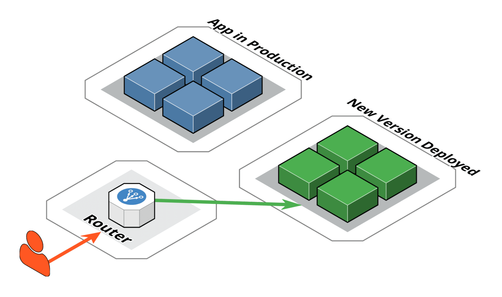

# Zero-Downtime Deploys

## What is it?

Zero-Downtime Deployment is a deployment strategy that allows software updates or releases to be rolled out without any service interruptions or downtime for users. This means that users can continue interacting with an application without noticing any disruption, even while new versions of the software are being deployed in the background.

This can be achieved through various techniques such as:

* **Blue-Green Deployments**: Two environments (blue and green) are maintained. The live environment (blue) continues running the current version of the software, while the new version is deployed to the other environment (green). Once the new version is confirmed stable, the traffic is switched from blue to green.  
* **Canary Deployments**: A new version is first rolled out to a small subset of users (the "canary group"). If successful, it is gradually rolled out to everyone.  
* **Rolling Updates**: Deployments are made in phases, with a portion of instances updated at a time, ensuring the rest remain operational.

## Why is it Important?

Zero-Downtime Deployments are crucial for businesses that rely on high availability and user experience. Here's why:

* **Maximizes Availability**: The key benefit is that users never experience service interruptions. Whether it's a small bug fix or a large feature release, the application remains accessible, which is critical for user satisfaction and business continuity.  
* **Minimizes Risk**: This strategy allows for gradual rollouts, meaning that any issues with new releases can be caught and mitigated before they affect the entire user base.  
* **Supports Fast Iterations**: Zero-Downtime Deployments facilitate faster release cycles, allowing teams to deploy updates more frequently and respond to customer needs in real time.  
* **Builds Trust**: For product managers and executives, this strategy ensures that releases can be aligned with business timelines without worrying about service interruptions. It also builds trust in the platform from both internal teams and external users.
